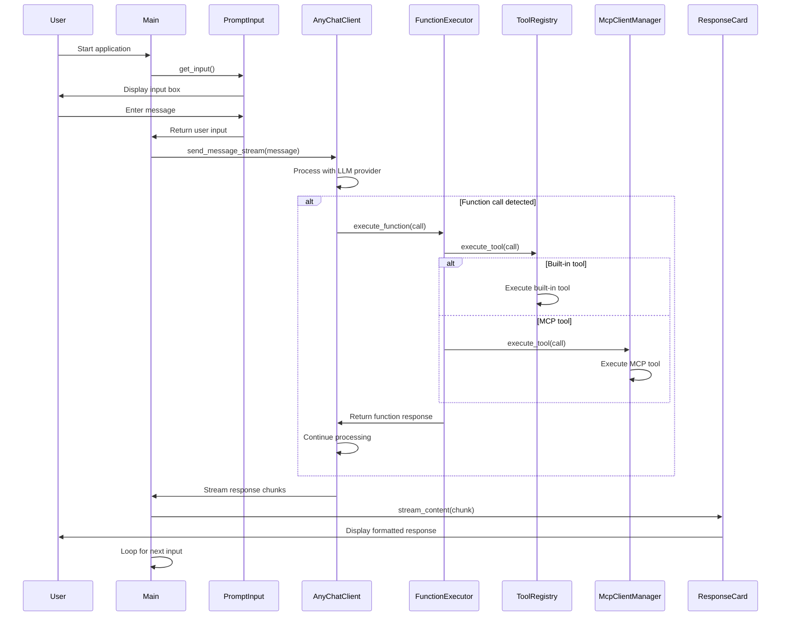
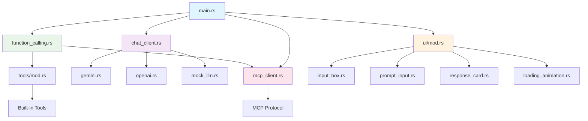

# Chat CLI Application - UML Architecture Diagram

## System Overview
This is a Rust-based chat CLI application that supports multiple LLM providers (OpenAI, Gemini, Mock), function calling, MCP (Model Context Protocol) integration, and a rich terminal UI.

## Core Architecture

```mermaid
classDiagram
    %% Core Application Entry Point
    class Main {
        +main()
        +run_chat_loop()
        +handle_user_input()
        +process_streaming_response()
    }

    %% Chat Client Abstraction Layer
    class ChatClient {
        <<interface>>
        +load_system_prompt(prompt: &str)
        +set_available_tools(tools: Vec~ToolDefinition~)
        +add_user_message(message: &str)
        +add_function_response(response: &FunctionResponse)
        +add_model_response(response: &str, calls: Vec~Value~)
        +clear_conversation()
        +send_message() Future~String~
        +send_message_stream() Future~Receiver~
        +client_name() &str
    }

    class AnyChatClient {
        +Gemini(GeminiClient)
        +OpenAI(OpenAIClient)
        +Mock(MockLLMClient)
        +new_gemini(api_key: String, model: String)
        +new_openai(api_key: String, model: String)
        +new_openai_with_base_url(api_key: String, model: String, base_url: String)
        +new_mock()
        +new_mock_with_responses(responses: Vec~String~)
    }

    %% LLM Provider Implementations
    class GeminiClient {
        -client: Client
        -api_key: String
        -model: String
        -base_url: String
        -conversation_history: Vec~Content~
        -system_instruction: Option~SystemInstruction~
        -available_tools: Vec~ToolDefinition~
        -structured_output_schema: Option~Value~
        +new(api_key: String, model: String)
        +with_structured_output_schema(schema: Value)
        +send_message_internal(request: GenerateContentRequest)
        +send_message_stream_internal(request: GenerateContentRequest)
    }

    class OpenAIClient {
        -client: Client
        -api_key: String
        -model: String
        -base_url: String
        -conversation_history: Vec~Message~
        -system_message: Option~String~
        -available_tools: Vec~ToolDefinition~
        -response_format: Option~ResponseFormat~
        +new(api_key: String, model: String)
        +with_base_url(base_url: String)
        +with_response_format(format: ResponseFormat)
        +send_chat_completion(request: ChatCompletionRequest)
        +send_chat_completion_stream(request: ChatCompletionRequest)
    }

    class MockLLMClient {
        -conversation_history: Vec~MockMessage~
        -system_prompt: Option~String~
        -responses: Vec~String~
        -response_index: usize
        -streaming_enabled: bool
        -delay_ms: u64
        -function_calls: HashMap~String, Value~
        +new()
        +with_responses(responses: Vec~String~)
        +with_streaming(enabled: bool)
        +with_delay(delay_ms: u64)
        +add_mock_function_call(name: String, response: Value)
    }

    %% Function Calling System
    class FunctionExecutor {
        -mcp_manager: Option~McpClientManager~
        -tool_registry: ToolRegistry
        +new()
        +with_mcp_manager(manager: McpClientManager)
        +get_available_tools() Vec~ToolDefinition~
        +execute_function(call: &FunctionCall) Future~FunctionResponse~
        -execute_shell_command(command: &str, id: &str) Future~FunctionResponse~
    }

    class FunctionCall {
        +name: String
        +args: Value
    }

    class FunctionResponse {
        +id: String
        +name: String
        +response: Value
    }

    class ToolDefinition {
        +name: String
        +description: String
        +parameters: Value
    }

    %% Tool System
    class Tool {
        <<interface>>
        +name() &str
        +description() &str
        +get_tool_definition() ToolDefinition
        +validate_params(params: &Value) Result
        +get_description(params: &Value) String
        +tool_locations(params: &Value) Vec~ToolLocation~
        +execute(params: &Value) Future~ToolResult~
    }

    class ToolRegistry {
        -tools: HashMap~String, Box~dyn Tool~~
        +new()
        +register_tool(tool: Box~dyn Tool~)
        +get_available_tools() Vec~ToolDefinition~
        +get_tool(name: &str) Option~&Box~dyn Tool~~
        +execute_tool(call: &FunctionCall) Future~FunctionResponse~
    }

    class ToolResult {
        +summary: Option~String~
        +llm_content: Value
        +return_display: String
    }

    class ToolLocation {
        +path: String
        +line: Option~usize~
    }

    %% Built-in Tools
    class ListDirectoryTool {
        +execute(params: &Value) Future~ToolResult~
    }
    class ReadFileTool {
        +execute(params: &Value) Future~ToolResult~
    }
    class SearchFileContentTool {
        +execute(params: &Value) Future~ToolResult~
    }
    class GlobTool {
        +execute(params: &Value) Future~ToolResult~
    }
    class ReplaceTool {
        +execute(params: &Value) Future~ToolResult~
    }
    class WriteFileTool {
        +execute(params: &Value) Future~ToolResult~
    }
    class WebFetchTool {
        +execute(params: &Value) Future~ToolResult~
    }
    class ReadManyFilesTool {
        +execute(params: &Value) Future~ToolResult~
    }
    class RunShellCommandTool {
        +execute(params: &Value) Future~ToolResult~
    }
    class SaveMemoryTool {
        +execute(params: &Value) Future~ToolResult~
    }
    class GoogleWebSearchTool {
        +execute(params: &Value) Future~ToolResult~
    }

    %% MCP (Model Context Protocol) Integration
    class McpClientManager {
        -clients: HashMap~String, RunningService~
        -tools: HashMap~String, (String, McpTool)~
        +new()
        +load_from_config(config: McpConfig) Future~Result~
        +get_available_tools() Vec~ToolDefinition~
        +execute_tool(call: &FunctionCall) Future~FunctionResponse~
        +has_tool(name: &str) bool
    }

    class McpConfig {
        +inputs: Option~Vec~McpInput~~
        +servers: HashMap~String, McpServerConfig~
    }

    class McpInput {
        +input_type: String
        +id: String
        +description: String
        +password: bool
    }

    class McpServerConfig {
        +command: String
        +args: Vec~String~
        +env: HashMap~String, String~
    }

    %% UI Components
    class PromptInput {
        -width: usize
        -prompt_text: String
        +new()
        +with_width(width: usize)
        +get_input() Result~String~
        -draw_complete_input_box_with_help() Result
    }

    class ResponseCard {
        -width: usize
        -title: String
        +new()
        +with_title(title: &str)
        +with_width(width: usize)
        +display_complete(content: &str) Result
        +start_streaming() Result
        +stream_content(chunk: &str) Result
        +end_streaming() Result
        -print_header() Result
        -print_footer() Result
        -print_content(content: &str) Result
        -wrap_text(text: &str, width: usize) Vec~String~
    }

    class InputBox {
        -lines: Vec~String~
        -current_line: usize
        -title: String
        +new(title: &str)
        +add_char(c: char)
        +add_newline()
        +remove_char()
        +clear()
        +draw() Result
        +get_input() Result~String~
    }

    class LoadingAnimation {
        -message: String
        -is_running: Arc~AtomicBool~
        -style: AnimationStyle
        +new(message: String)
        +with_style(style: AnimationStyle)
        +start() Future
        +stop()
        +show_progress(current: usize, total: usize)
    }

    class AnimationStyle {
        <<enumeration>>
        Spinner
        Dots
        Progress
        Docker
    }

    %% Relationships
    Main --> AnyChatClient : uses
    Main --> FunctionExecutor : uses
    Main --> PromptInput : uses
    Main --> ResponseCard : uses
    Main --> LoadingAnimation : uses

    AnyChatClient --> ChatClient : implements
    AnyChatClient --> GeminiClient : contains
    AnyChatClient --> OpenAIClient : contains
    AnyChatClient --> MockLLMClient : contains

    GeminiClient --> ChatClient : implements
    OpenAIClient --> ChatClient : implements
    MockLLMClient --> ChatClient : implements

    FunctionExecutor --> ToolRegistry : uses
    FunctionExecutor --> McpClientManager : uses
    FunctionExecutor --> FunctionCall : processes
    FunctionExecutor --> FunctionResponse : returns

    ToolRegistry --> Tool : manages
    ToolRegistry --> ToolDefinition : provides

    Tool <|-- ListDirectoryTool : implements
    Tool <|-- ReadFileTool : implements
    Tool <|-- SearchFileContentTool : implements
    Tool <|-- GlobTool : implements
    Tool <|-- ReplaceTool : implements
    Tool <|-- WriteFileTool : implements
    Tool <|-- WebFetchTool : implements
    Tool <|-- ReadManyFilesTool : implements
    Tool <|-- RunShellCommandTool : implements
    Tool <|-- SaveMemoryTool : implements
    Tool <|-- GoogleWebSearchTool : implements

    Tool --> ToolResult : returns
    Tool --> ToolLocation : provides

    McpClientManager --> McpConfig : uses
    McpConfig --> McpInput : contains
    McpConfig --> McpServerConfig : contains

    LoadingAnimation --> AnimationStyle : uses

    ChatClient --> ToolDefinition : uses
    ChatClient --> FunctionResponse : uses
```

## Component Interaction Flow

## Key Design Patterns

1. **Strategy Pattern**: `AnyChatClient` enum allows switching between different LLM providers
2. **Trait Objects**: `Tool` trait enables extensible tool system
3. **Builder Pattern**: UI components like `ResponseCard` and `PromptInput` use builder methods
4. **Observer Pattern**: Streaming responses use async channels for real-time updates
5. **Plugin Architecture**: MCP integration allows external tool providers
6. **Facade Pattern**: `FunctionExecutor` provides unified interface for tool execution

## Module Dependencies

